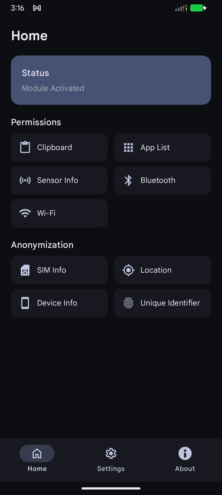
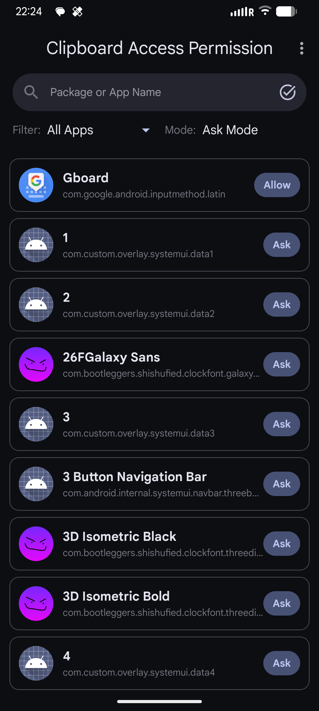
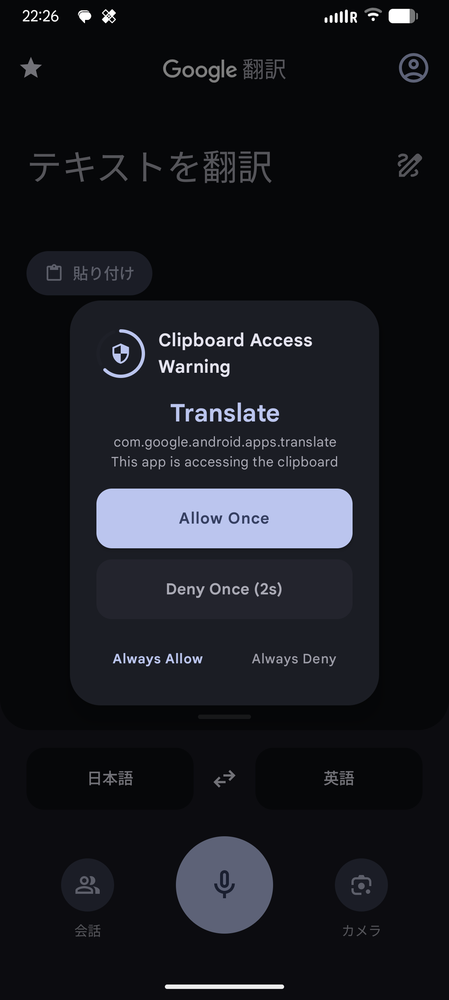
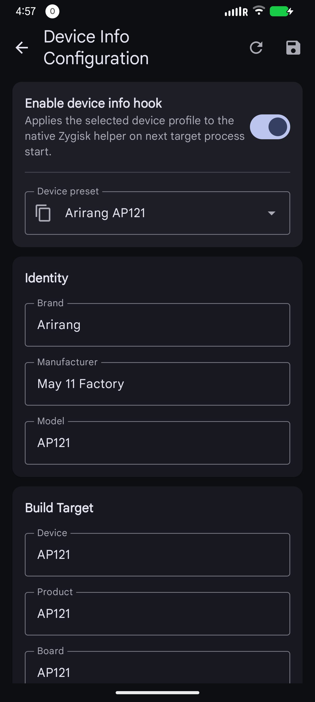
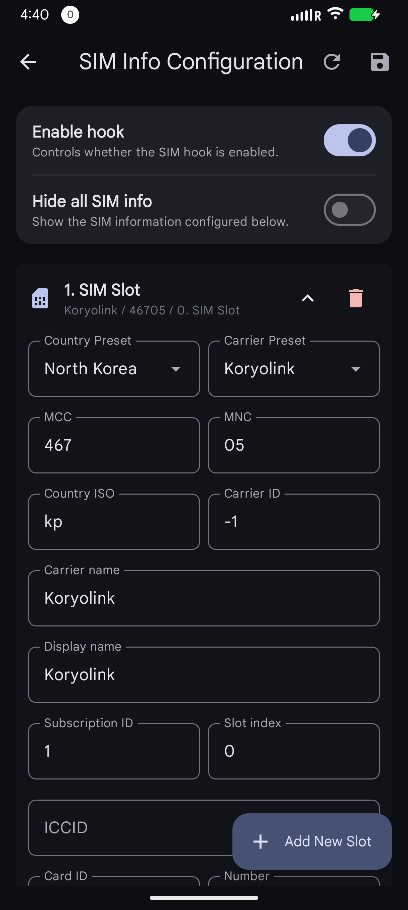
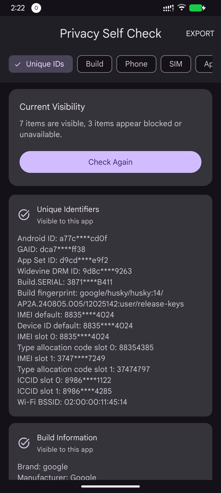

# Arirang

Arirang is named after a smartphone brand from North Korea.

This is a powerful Xposed module for Android designed to enhance user privacy through fine-grained control over sensitive system information and runtime hooks. It allows spoofing of device identifiers, location, SIM information, Wi-Fi information, and app visibility.

## Philosophy

Arirang is designed around a system-level privacy protection model.

Unlike many traditional Xposed privacy modules, Arirang does not aim to inject hooks into arbitrary third-party applications whenever possible.  
Instead, the project attempts to keep hooks, data interception, and data rewriting inside system-level components and framework layers.

The goal of this design is to:
- Avoid unnecessary impact on application performance
- Minimize interference with normal application runtime behavior

## 🔌 Native Submodule (Beta)

Arirang provides a native Zygisk extension module named
`arirang-submodule`.

This submodule is a required beta-stage capability extension layer for
functionality that cannot be reliably implemented through LSPosed or
framework-level Java hooks alone.

The current implementation avoids per-application specialization hooks. Native
fallback hooks are installed at the Zygote/framework boundary so child processes
inherit the rewritten framework behavior instead of receiving app-specific hook
installation whenever possible.

Depending on the feature, the submodule may be:
- Required to implement certain low-level behaviors
- Used to strengthen spoofing consistency and anti-detection capabilities
- Used to extend privacy protection into native framework surfaces such as
  `SystemProperties` and `MediaDrm`

The long-term goal remains to move functionality into system framework services
where possible and keep this submodule as the deeper native fallback layer for
surfaces that do not expose a suitable system service hook point.

## 🔎 Privacy Self-Check App

Arirang includes an independent companion application for inspecting what device
information is visible to ordinary apps and verifying whether privacy protection
features are working correctly.

Current checks include device info, unique identifiers, SIM information, Android
location APIs, Google Fused Location APIs, accounts, Bluetooth devices, Wi-Fi
information, sensors, and installed packages.

## ⚠️ Warning

This software is in an early development stage and may cause system instability, crashes, or unexpected behavior.

This project does **not** prohibit the use of AI-generated code.

During early prototyping and experimental development, a considerable amount of code was generated or assisted by large language models (LLMs).  
Some parts of the codebase may therefore contain:
- Inconsistent implementations
- Redundant abstractions
- Experimental structures
- Non-optimal patterns

As the project matures, these sections are gradually being rewritten, simplified, or replaced with manually reviewed implementations.

Use at your own risk.

## 🚀 Features

- **Clipboard Protection (Available)**  
  Monitor and intercept clipboard access requests with real-time confirmation dialogs.

- **Real-time Permission Prompt (Available)**  
  Intercept clipboard access attempts and explicitly allow or deny each request.

- **SIM Info Mocking (Experimental)**
  Configure SIM profiles, hide SIM information, and rewrite visible telephony data.

- **Device Info Masking (Experimental)**
  Configure visible device model, brand, manufacturer, product, hardware, board,
  bootloader, fingerprint, and related Android build fields.

- **Unique Identifier Spoofing (Experimental)**
  Configure Android ID, Google Advertising ID, App Set ID, SSAID-style identifiers,
  IMEI/MEID, TAC, serial number, subscriber ID, phone number, and SIM ICCID values.

- **Virtual Location (Experimental)**
  Configure a virtual latitude, longitude, altitude, accuracy, speed, bearing, and
  satellite count. The implementation covers Android framework location APIs,
  fused location paths, Google Fused Location APIs, GNSS status, and NMEA reports.

- **Wi-Fi Info Masking (Experimental)**  
  Configure the current Wi-Fi SSID and BSSID returned from framework Wi-Fi service
  paths on modern Android. Other `WifiInfo` fields currently use fixed spoofed
  fallback values, including MAC address, RSSI, frequency, and network ID.

- **Nearby Wi-Fi List Masking (Experimental)**  
  Configure one or more nearby Wi-Fi scan result SSID/BSSID pairs, or return an empty
  scan list. The implementation rewrites both `WifiServiceImpl.getScanResults(...)`
  and the underlying `ScanRequestProxy.getScanResults()` path used by Android's
  Wi-Fi service. Scan result metadata such as signal level, frequency, capabilities,
  and timestamp is generated by the hook.

- **Package List Management (In Development)**  
  Hide installed applications (Invisible / Whitelist modes).

- **Hook Log Controls (Available)**  
  Enable or disable LSPosed log output per hook module, including core, clipboard,
  Google services, location, package list, settings provider, SIM, Wi-Fi, unique
  identifiers, and hook service bridge logs.

- **Modern UI**  
  Built with Material Design 3, Dynamic Colors support, and native configuration
  pages for the currently released features.

- **Multi-language Support**
  English, Simplified Chinese, and Japanese translations are included.

## 📸 Screenshots

| Main | Clipboard | Clipboard Dialog |
| --- | --- | --- |
|  |  |  |

| Device Info | SIM Mocking | Privacy Self-Check |
| --- | --- | --- |
|  |  |  |

## 🛠 Requirements

- Rooted Android device
- **LSPosed** or compatible Xposed framework
- Android 14 or later
- Android 16 is the current recommended target for testing
- Magisk, KernelSU / KernelSU Next, or APatch (required for native submodule features)
- Zygisk (required for native submodule features)

## 📦 Installation

1. Install the latest `Arirang` APK  
2. Optional: install the latest `Arirang Self-Check` APK if you want to verify
   what information ordinary apps can see after hooks are enabled.
3. Open your Xposed Manager (e.g., LSPosed)  
4. Enable the **Arirang** module  
5. Select scope:
   - System / Android framework (required)
   - `com.android.phone`
   - `com.google.android.gms`

#### Install `arirang-submodule` (Required for Native Features)

Some native framework fallback features require the Zygisk helper module.

1. Download `arirang-submodule.zip`
2. Flash the ZIP through:
  - Magisk
  - KernelSU / KernelSU Next
  - APatch
3. Reboot the device

## 🤝 Contributing

Contributions, issues, and feature requests are welcome.
