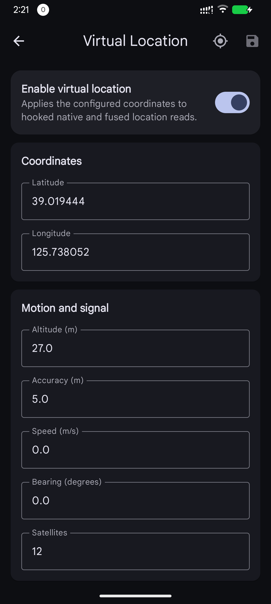
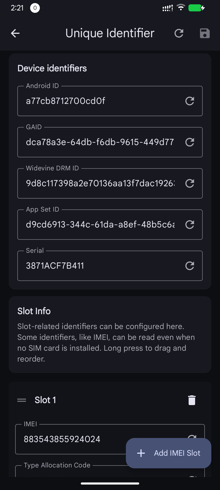
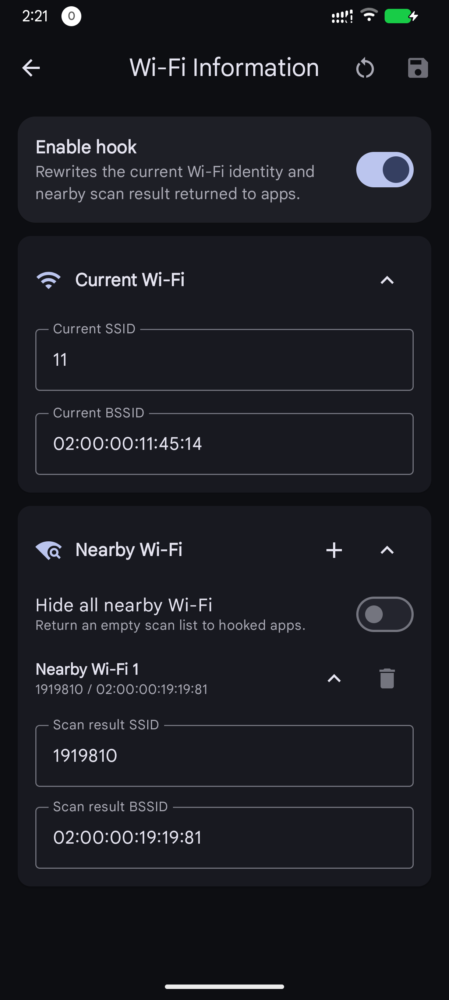
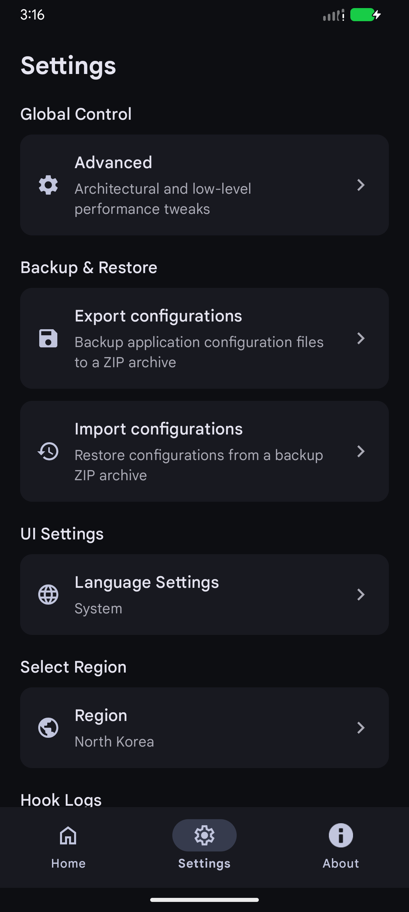

# Arirang

Arirang is named after a smartphone brand from North Korea.

This is a powerful Xposed module for Android designed to enhance user privacy through fine-grained control over sensitive system information and runtime hooks. It allows spoofing of device identifiers, location, SIM information, Wi-Fi information, and app visibility.

## Philosophy

Arirang is designed around a system-level privacy protection model.

Unlike many traditional Xposed privacy modules, Arirang does not aim to inject hooks into arbitrary third-party applications whenever possible.  
Instead, the project attempts to keep hooks, data interception, and data rewriting inside system-level components and framework layers.

The goal of this design is to:
- Avoid unnecessary impact on application performance
- Minimize interference with normal application runtime behavior

## 🔌 Native Submodule (Beta)

Arirang provides a native Zygisk extension module named
`arirang-submodule`.

This submodule is a native capability extension for
implementing functionality that cannot be achieved reliably through the
LSPosed module or framework-level Java hooks alone.

It complements the LSPosed module by providing lower-level native
implementations where Java-layer hooks are insufficient or unavailable.

Depending on the feature, the submodule may be used to:

* Implement low-level native behaviors beyond the scope of LSPosed
* Strengthen spoofing consistency and anti-detection capabilities
* Extend privacy protection to native framework surfaces such as
  `SystemProperties` and `MediaDrm`

The long-term goal is to keep higher-level functionality within the LSPosed
module whenever practical, while using this submodule as the required native
extension layer for capabilities that require native framework integration.

## 🔎 Privacy Self-Check App

Arirang includes an independent companion application for inspecting what device
information is visible to ordinary apps and verifying whether privacy protection
features are working correctly.

Current checks include device info, unique identifiers, SIM information, Android
location APIs, Google Fused Location APIs, accounts, Bluetooth devices, Wi-Fi
information, sensors, and installed packages.

## ⚠️ Warning

This software is **still under active development** and should be considered **unstable**. It may cause crashes, unexpected behavior, data inconsistency, or other system instability.

The project is currently undergoing **manual code review and defect remediation**, but this process is **still in progress** and **does not imply that the software is stable or production-ready**.

This project does **not** prohibit the use of AI-generated code.

During early prototyping and experimental development, a considerable amount of code was generated or assisted by large language models (LLMs). As a result, parts of the codebase may still contain:

* Incomplete or incorrect implementations
* Logic defects and edge-case issues
* Redundant or experimental structures
* Non-optimal or inconsistent code patterns

Use at your own risk.

## 🚀 Features

- **Clipboard Protection (Available)**  
  Monitor and intercept clipboard access requests with real-time confirmation dialogs.

- **Real-time Permission Prompt (Available)**  
  Intercept clipboard access attempts and explicitly allow or deny each request.

- **SIM Info Mocking (Experimental)**
  Configure SIM profiles, hide SIM information, and rewrite visible telephony data.

- **Device Info Masking (Experimental)**
  Configure visible device model, brand, manufacturer, product, hardware, board,
  bootloader, fingerprint, and related Android build fields.

- **Unique Identifier Spoofing (Experimental)**
  Configure Android ID, Google Advertising ID, App Set ID, SSAID-style identifiers,
  IMEI/MEID, TAC, serial number, subscriber ID, phone number, and SIM ICCID values.

- **Virtual Location (Experimental)**
  Configure a virtual latitude, longitude, altitude, accuracy, speed, bearing, and
  satellite count. The implementation covers Android framework location APIs,
  fused location paths, Google Fused Location APIs, GNSS status, and NMEA reports.

- **Wi-Fi Info Masking (Experimental)**  
  Configure the current Wi-Fi SSID and BSSID returned from framework Wi-Fi service
  paths on modern Android. Other `WifiInfo` fields currently use fixed spoofed
  fallback values, including MAC address, RSSI, frequency, and network ID.

- **Nearby Wi-Fi List Masking (Experimental)**  
  Configure one or more nearby Wi-Fi scan result SSID/BSSID pairs, or return an empty scan list.
  Allows customizing or hiding nearby Wi-Fi network information exposed to applications.

- **Package List Management (In Experimental)**  
  Hide installed applications (Invisible / Whitelist modes).

- **Sensor List Management (Experimental)**
  Configure the sensor list exposed to applications by hiding or rewriting selected
  sensors, and reduce the reported precision of supported sensor data to limit
  fingerprinting and improve privacy.

- **Hook Log Controls (Available)**  
  Enable or disable LSPosed log output per hook module, including core, clipboard,
  Google services, location, package list, settings provider, SIM, Wi-Fi, unique
  identifiers, and hook service bridge logs.

- **Modern UI**  
  Built with Material Design 3, Dynamic Colors support, and native configuration
  pages for the currently released features.

- **Multi-language Support**
  English, Simplified Chinese, and Japanese translations are included.

## 📸 Screenshots

| Main | Clipboard | Clipboard Dialog |
| --- | --- | --- |
|  |  |  |

| Device Info | SIM Mocking | Privacy Self-Check |
| --- | --- | --- |
|  |  |  |

| Location | Unique Identifiers | Wi-Fi |
| --- | --- | --- |
|  |  |  |

| Settings |
| --- |
|  |

## 🛠 Requirements

- Rooted Android device
- **LSPosed** or compatible Xposed framework
- Android 14 or later
- Android 16 is the current recommended target for testing
- Magisk, KernelSU / KernelSU Next, or APatch (required for native submodule features)
- Zygisk (required for native submodule features)

## 📦 Installation

1. Install the latest `Arirang` APK
2. Optional: install the latest `Arirang Self-Check` APK if you want to verify
   what information ordinary apps can see after hooks are enabled.
3. Open your Xposed Manager (e.g., LSPosed)  
4. Enable the **Arirang** module  
5. Select scope:
   - System / Android framework (required)
   - `com.android.phone`
   - `com.google.android.gms`

1. Download `arirang-submodule.zip`
2. Flash the ZIP through:
  - Magisk
  - KernelSU / KernelSU Next
  - APatch
3. Reboot the device

## 🤝 Contributing

Contributions, issues, and feature requests are welcome.
