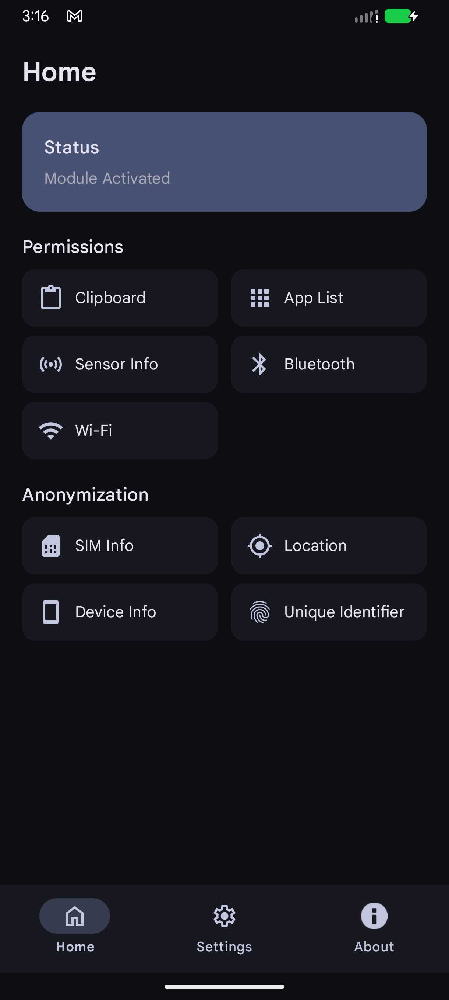
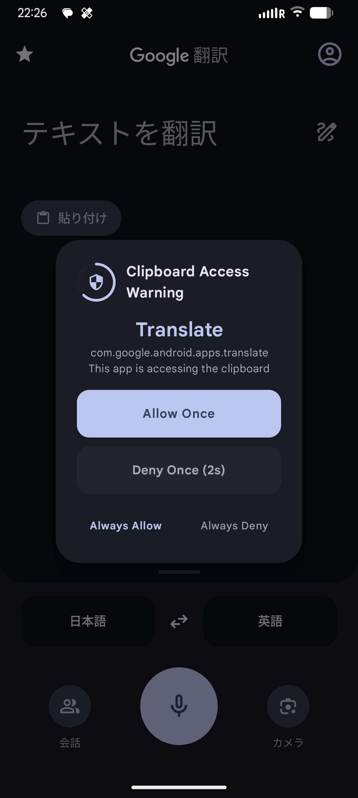
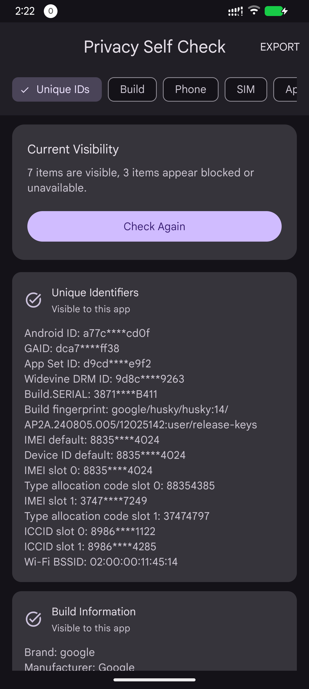

# Arirang

Arirang is named after a smartphone brand from North Korea.

This is a powerful Xposed module for Android designed to enhance user privacy through fine-grained control over sensitive system information and runtime hooks. It allows spoofing of device identifiers, location, SIM information, Wi-Fi information, and app visibility.

> 📚 **Documentation**: [Full Features & Technical Limitations](docs/features.md) · 🔌 [Native Submodule Architecture](docs/submodule.md) · 📸 [Screenshots Gallery](docs/screenshots.md)

---

## Philosophy

Arirang is designed around a system-level privacy protection model.

Unlike many traditional Xposed privacy modules, Arirang does not aim to inject hooks into arbitrary third-party applications whenever possible.  
Instead, the project attempts to keep hooks, data interception, and data rewriting inside system-level components and framework layers.

The goal of this design is to:
- Avoid unnecessary impact on application performance
- Minimize interference with normal application runtime behavior

---

## 🔌 Native Submodule (Beta)

Arirang provides a native Zygisk extension module named `arirang-submodule`.

This submodule complements the LSPosed module by providing lower-level native implementations (such as `SystemProperties` and `MediaDrm` handling) where Java-layer hooks are insufficient or unavailable. It operates with minimal in-app residency and unloads immediately after process specialization.

👉 *See [docs/submodule.md](docs/submodule.md) for full architectural details.*

---

## 🔎 Privacy Self-Check App

Arirang includes an independent companion application for inspecting what device information is visible to ordinary apps and verifying whether privacy protection features are working correctly.

Current checks include device info, unique identifiers, SIM information, Android location APIs, Google Fused Location APIs, accounts, Bluetooth devices, Wi-Fi information, sensors, and installed packages.

---

## ⚠️ Warning

This software is **still under active development** and should be considered **unstable**. It may cause crashes, unexpected behavior, data inconsistency, or other system instability.

The project is currently undergoing **manual code review and defect remediation**, but this process is **still in progress** and **does not imply that the software is stable or production-ready**.

This project does **not** prohibit the use of AI-generated code. During early prototyping and experimental development, a considerable amount of code was generated or assisted by large language models (LLMs). Parts of the codebase may still contain defects, edge-case bugs, or experimental structures. Use at your own risk.

---

## 🚀 Features

- [**Clipboard Protection**](docs/features.md#clipboard-protection) **(Available)**  
  Monitor and intercept clipboard access requests with real-time confirmation dialogs.

- [**Real-time Permission Prompt**](docs/features.md#real-time-permission-prompt) **(Available)**  
  Intercept clipboard access attempts and explicitly allow or deny each request.

- [**SIM Info Mocking**](docs/features.md#sim-info-mocking) **(Experimental)**  
  Configure SIM profiles, hide cellular data, and rewrite telephony carrier information.

- [**Device Info Masking**](docs/features.md#device-info-masking) **(Experimental)**  
  Configure visible device model, brand, manufacturer, fingerprint, and related build fields.

- [**Unique Identifier Spoofing**](docs/features.md#unique-identifier-spoofing) **(Experimental)**  
  Configure Android ID, GAID, App Set ID, IMEI/MEID, TAC, serial number, and SIM ICCID.

- [**Virtual Location**](docs/features.md#virtual-location) **(Experimental)**  
  Configure virtual coordinates, altitude, accuracy, and satellite count across framework and Fused Location APIs.

- [**Wi-Fi Info Masking**](docs/features.md#wi-fi-info-masking) **(Experimental)**  
  Configure connected Wi-Fi SSID, BSSID, IP, gateway, and DNS on framework service paths.

- [**Nearby Wi-Fi List Masking**](docs/features.md#nearby-wi-fi-list-masking) **(Experimental)**  
  Spoof nearby Wi-Fi scan results or return an empty scan list.

- [**Bluetooth Info Masking**](docs/features.md#bluetooth-info-masking) **(Experimental)**  
  Configure local Bluetooth name/MAC, bonded devices list, and nearby scan results.

- [**Package Visibility Management**](docs/features.md#package-visibility-management) **(Experimental)**  
  Filter installed apps, queries, and package lookups at the system PackageManager layer.

- [**Sensor List Management**](docs/features.md#sensor-list-management) **(Experimental)**  
  Hide selected sensors, rename sensor hardware strings, and reduce motion sensor event precision.

- [**VPN Status Masking**](docs/features.md#vpn-status-masking) **(Experimental)**  
  Hide VPN transport, tunnel interfaces (in LinkProperties), always-on VPN, and HTTP proxy state in system_server.

- [**Language & Time Zone Masking**](docs/features.md#language--time-zone-masking) **(Experimental / Imperfect)**  
  Configure per-app language tags and default time zone via property CoW remapping. *Note: Subject to sandbox and raw-syscall limitations, see details.*

- [**Hook Log Controls**](docs/features.md#hook-log-controls) **(Available)**  
  Enable or disable LSPosed log output per hook module.

---

## 🛠 Requirements

- Rooted Android device
- **LSPosed** or compatible Xposed framework
- Android 15 or later (Android 16 recommended)
- Magisk, KernelSU / KernelSU Next, or APatch (required for native submodule)
- Zygisk (required for native submodule)

---

## 📦 Installation

1. Install the latest `Arirang` APK (and optional `Arirang Self-Check` APK).
2. Open your Xposed Manager (e.g., LSPosed) and enable **Arirang**.
3. Select scope:
   - System / Android framework (required)
   - `com.android.phone`
   - `com.google.android.gms`
4. For native submodule features: flash `arirang-submodule.zip` in Magisk / KernelSU / APatch and reboot.

---

## 📸 Screenshots

| Main | Clipboard Dialog | Privacy Self-Check |
| :---: | :---: | :---: |
|  |  |  |

👉 *[View all 16 screenshots in the Gallery →](docs/screenshots.md)*

---

## 🤝 Contributing

Contributions, issues, and feature requests are welcome.
