# Arirang UI Gallery

Below are interface screenshots of Arirang's Material Design 3 management app.

---

## Overview

| Main Screen | Clipboard Protection | Clipboard Prompt Dialog |
| :---: | :---: | :---: |
|  | 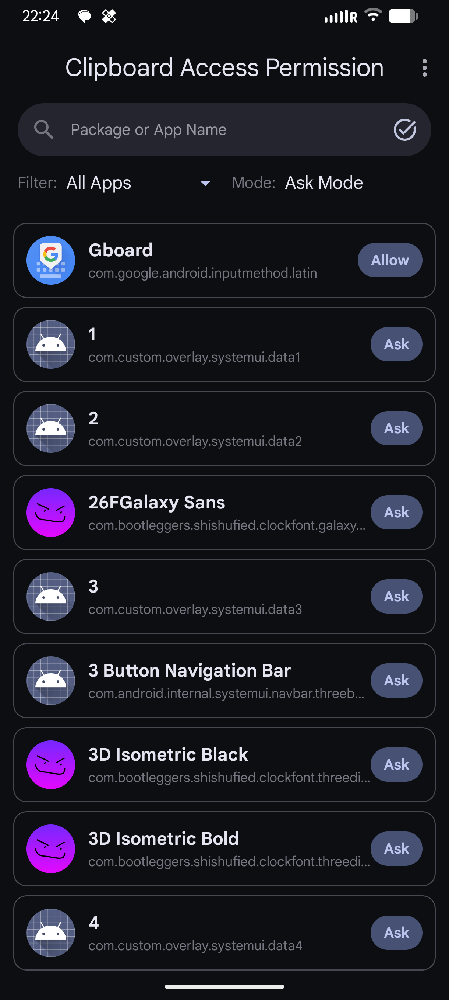 |  |

---

## Identity & Network

| Device Info Masking | SIM Mocking | Privacy Self-Check App |
| :---: | :---: | :---: |
| 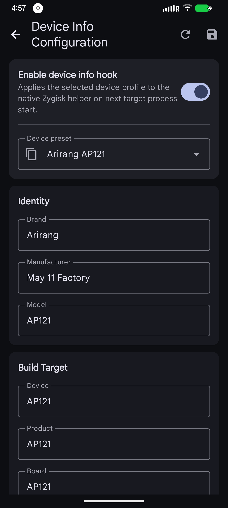 | 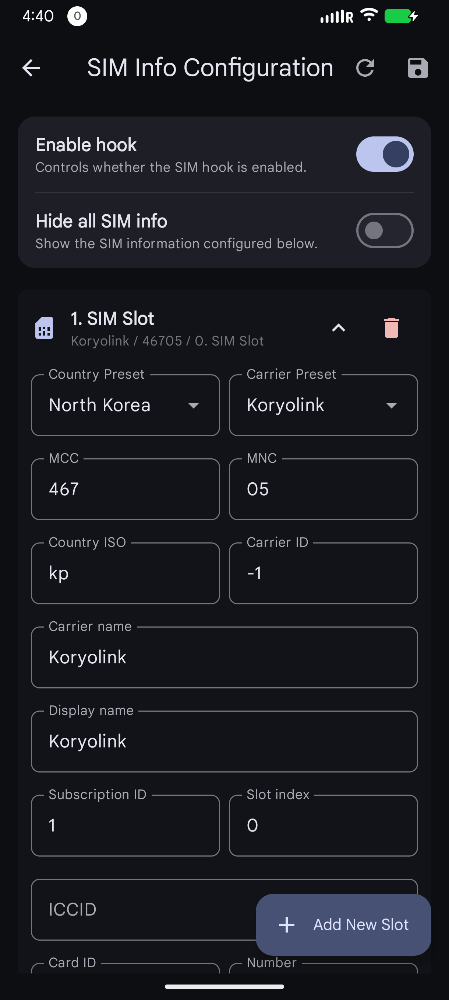 |  |

| Virtual Location | Unique Identifiers | Wi-Fi Information |
| :---: | :---: | :---: |
| 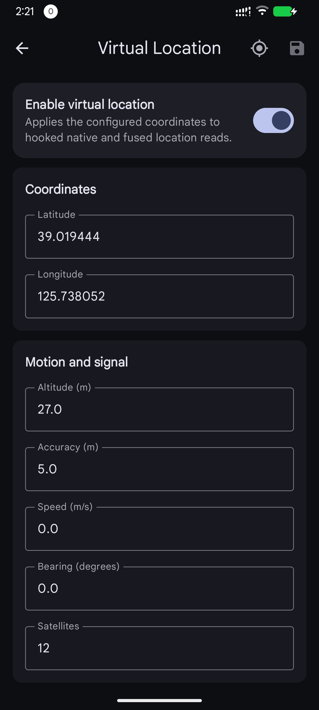 | 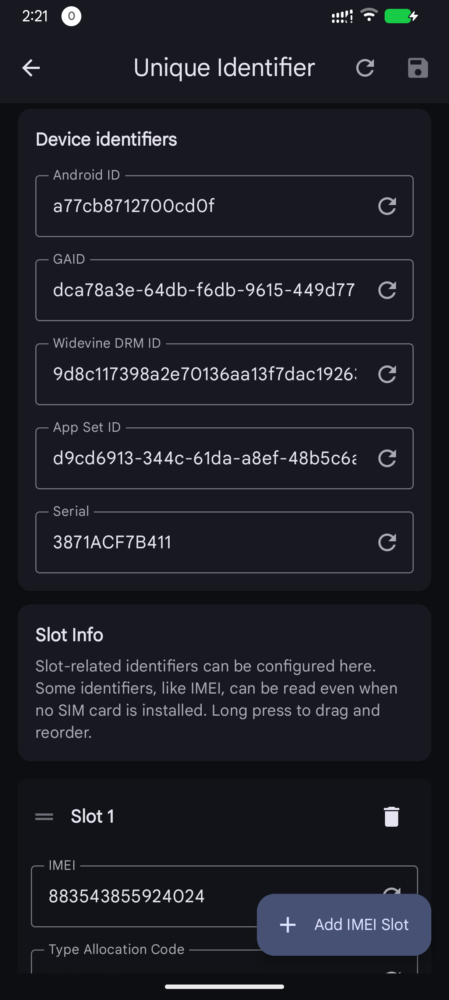 | 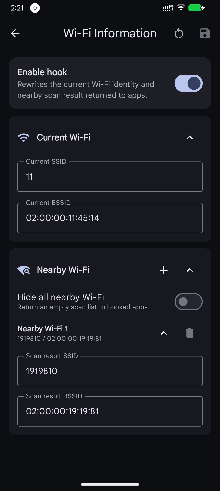 |

---

## Sensors & Peripherals

| Bluetooth Masking | Sensor List Overview | Sensor Rule Details |
| :---: | :---: | :---: |
| 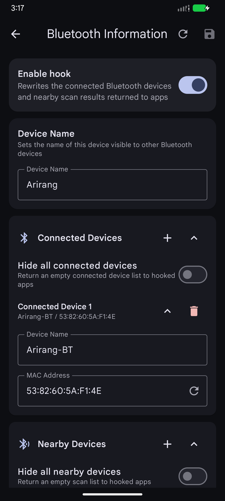 | 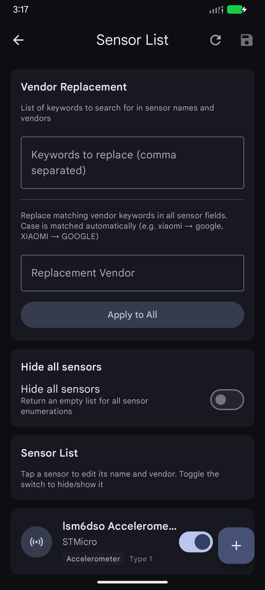 | 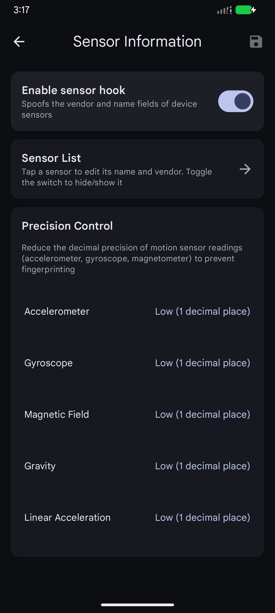 |

---

## Package Filtering & Settings

| App List Filtering | Per-App Location Overrides | Settings Page |
| :---: | :---: | :---: |
| 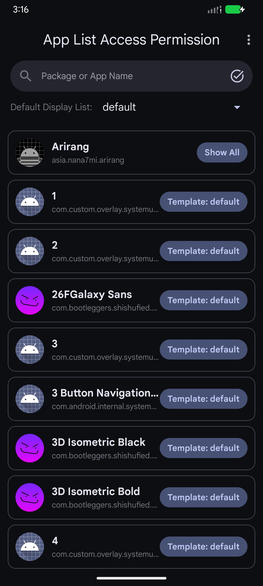 | 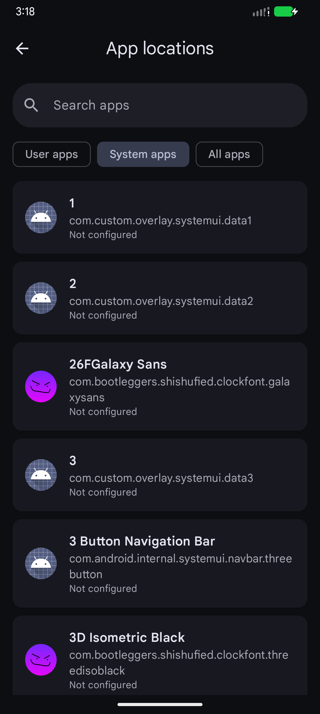 | 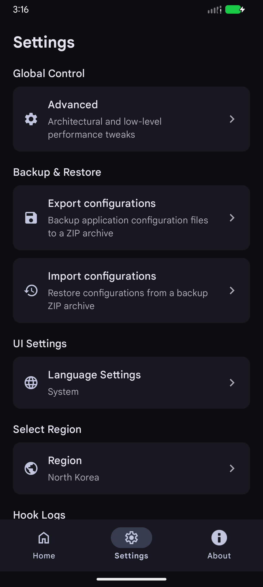 |

| About Page |
| :---: |
| 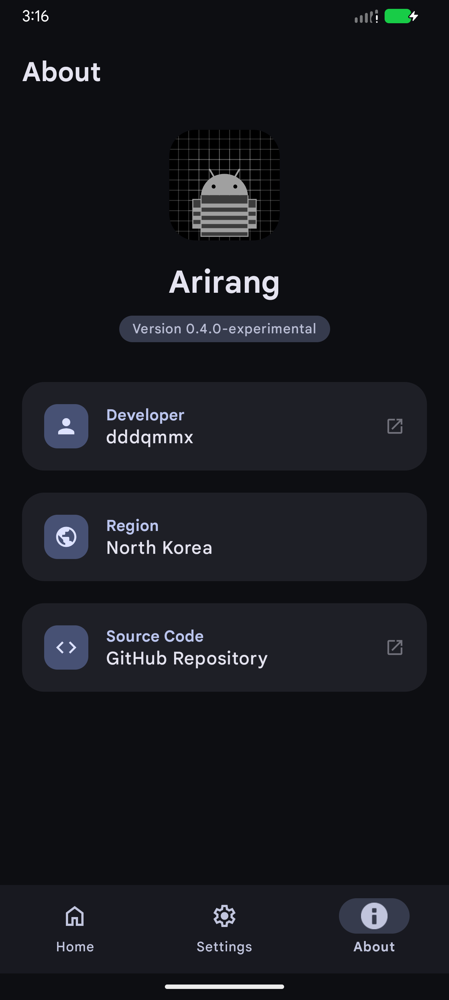 |
